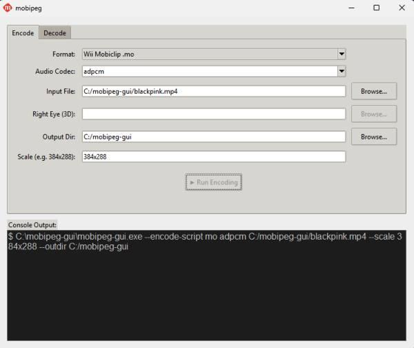

# mobipeg



**mobipeg** is a fork of [FFmpeg](https://ffmpeg.org/) with added support for encoding and decoding Nintendo MobiClip video formats. It uses [x264](https://github.com/quatric/x264) for H.264 encoding and bundles a GUI tool (`encode_gui`) for easy use.

## Supported Formats

| Format | Container | Platform | Encode | Decode |
|--------|-----------|----------|--------|--------|
| MOFLEX 2D | `.moflex` | Nintendo 3DS | ✅ | ✅ |
| MOFLEX 3D | `.moflex` | Nintendo 3DS | ✅ | ✅ |
| MODS | `.mods` | Nintendo DS | ✅ | ✅ |
| MO | `.mo` | Nintendo Wii | ✅ | ✅ |

## Audio Codec Support

| Audio Codec | MOFLEX (3DS) | MODS (DS) | MO (Wii) |
|-------------|:------------:|:---------:|:--------:|
| ADPCM | ✅ | ✅ | ✅ |
| FastAudio | ✅ | ✅ | ✅ |
| PCM | ✅ | ✅ | ✅ |
| Vorbis | ➖ | ➖ | ✅ |
| Codebook (SX) | ➖ | ✅ | ➖ |

## Building

```sh
./configure \
  --enable-gpl \
  --enable-libx264 \
  --enable-libvorbis
make -j$(nproc)
```

See [quatric/x264](https://github.com/quatric/x264) for the compatible x264 build.

## GUI Tool

A standalone GUI encoder (`encode_gui`) is available as a pre-built application in the [Releases](../../releases) section for Windows, macOS, and Linux. It bundles the mobipeg binary and requires no additional setup.

## Contact

General questions or comments can be sent to [quatricsoftware@gmail.com](mailto:quatricsoftware@gmail.com). No support will be provided for this tool.

## Credits

See [CREDITS_MOBICLIP.md](CREDITS_MOBICLIP.md) for the projects and authors that made the Mobiclip support possible.

## License

mobipeg inherits the FFmpeg license (LGPL v2.1+, GPL v2+ when built with `--enable-gpl`). See [COPYING.GPLv2](COPYING.GPLv2) and [COPYING.LGPLv2.1](COPYING.LGPLv2.1).

Copyright (c) 2026 quatric